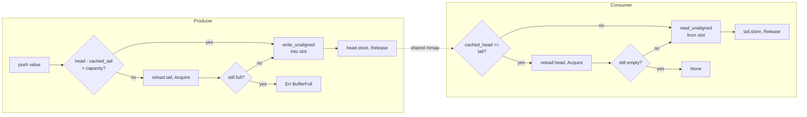
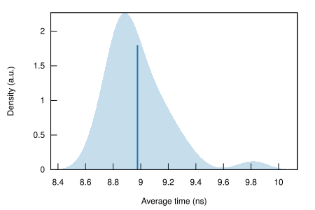
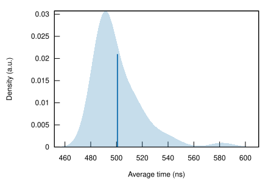
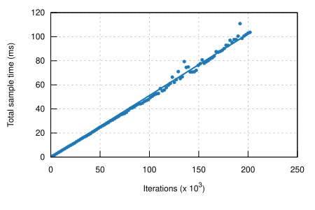

<h1 align="center">⚡ Xfeatures IPC</h1>

<p align="center">
  <b>Zero-copy, lock-free SPSC IPC over shared memory.</b><br>
  Written in Rust on top of <a href="https://docs.rs/memmap2">memmap2</a> — once the mapping is
  established, sending a message costs zero syscalls.
</p>

<p align="center">
  
  
  
  
</p>

---

Xfeatures IPC is a Single-Producer Single-Consumer ring buffer for passing
`T: Copy` values between two processes (or threads) with no locks and no
copies through the kernel. The channel is a single memory-mapped file —
`/dev/shm/xfeatures_ipc_<name>` on Unix, a temp-dir-backed file on Windows —
carved into a small atomic header and a power-of-two array of slots. A push
writes the value straight into a slot and bumps an atomic index; a pop reads
it back the same way. No sockets, no `read`/`write`, no context switch.

It is **generic and fail-fast**: any `#[repr(C)] struct` that is `Copy` can go
through the ring as-is, and a full buffer returns `IpcError::BufferFull`
immediately instead of blocking the producer. There's no framing, no
serialization, and no negotiation between the two sides — the crate trusts
that both ends agree on `T` and enforces it with a magic number and a
capacity/item-size check, not a schema.

> **Beta.** The ring is exercised by unit, integration and criterion
> benchmarks (see below), but it hasn't seen production traffic. It also
> assumes a **cooperative peer** — the safety of `unsafe impl Send/Sync` rests
> on the SPSC contract (one writer, one reader) holding on both sides; a
> malicious or buggy peer writing to the "wrong" half of the mapping isn't
> defended against.

## Highlights

- **Zero-copy.** Values are written directly into the shared-memory slot with
  `ptr::write_unaligned` — no intermediate buffer, no serialization step.
- **Lock-free SPSC.** No mutexes, no rwlocks, no spinlocks on the push/pop
  path — just two atomics.
- **Cache-line padded indices** (`#[repr(C, align(64))]`). Producer's `head`
  and consumer's `tail` live on separate 64-byte lines, so the two sides never
  invalidate each other's cache line.
- **Acquire/Release, not SeqCst.** Memory visibility between the two sides
  costs a fence, not a full sequential-consistency barrier.
- **Local index caching.** Each side caches the other's index and only
  re-reads the shared atomic when its local view says full/empty — most
  pushes and pops never touch the cross-core memory traffic at all.
- **Fail-fast.** `push()` returns `IpcError::BufferFull` the instant the ring
  is full; it never spins or blocks waiting for the consumer.
- **Unaligned-safe generics.** `T: Copy` is (de)serialized via
  `ptr::write_unaligned`/`read_unaligned`, so it's sound on strict-alignment
  targets, not just x86.
- **Cross-platform backing file.** `/dev/shm` on Unix, `%TEMP%` on Windows,
  behind the same `IpcBuilder` API.

## How it works



The cached-index check runs before touching the other side's atomic on
purpose: as long as the ring isn't actually full or empty, `push`/`pop` never
issue a cross-core atomic load, only the final `Release` store that makes the
new value visible. The shared header also carries a magic value
(`0x58495043`, `'XIPC'`) and the capacity/item-size the creator used, so a
consumer attaching to a stale or mismatched segment gets `InvalidMagic` or
`ConfigMismatch` instead of silently reading garbage.

## Benchmarks (lab)

Criterion, Debian 12, Xfeatures IPC vs. non-blocking Unix Domain Sockets doing
the same push/pop round trip. Full raw HTML reports are in
[`server_benchmarks/`](server_benchmarks).

<p align="center">
  
  
</p>
<p align="center"><sub>Latency distribution (PDF): Xfeatures IPC (left) vs Unix Domain Sockets (right)</sub></p>

| | latency | throughput |
|---|---|---|
| Xfeatures IPC | **8.9 ns**/msg | **~112,000,000** msg/sec |
| Unix Domain Sockets (non-blocking) | ~511 ns/msg | — |

Head-to-head, that's roughly **57x** lower latency than UDS.

<p align="center">
  
  
</p>
<p align="center"><sub>Time vs. iterations: Xfeatures IPC (left) vs Unix Domain Sockets (right)</sub></p>

The PDF plots show why the averages diverge as much as they do: Xfeatures IPC
clumps tightly around 8.9 ns with no heavy tail, while UDS has a long tail
into the microsecond range from OS scheduling. The regression plots tell the
same story over iterations — Xfeatures IPC scales as a tight, near-flat line,
UDS shows the vertical scatter of kernel buffer locking and syscall overhead.

> These are single-machine numbers from `cargo bench` (see
> [`benches/ipc_benchmark.rs`](benches/ipc_benchmark.rs)) — reproduce them on
> your own hardware before depending on the figures.

## Quickstart

Add the dependency:

```bash
cargo add xfeatures-ipc
```

Build a producer/consumer pair and push/pop any `T: Copy`:

```rust
use xfeatures_ipc::IpcBuilder;
use std::thread;

#[derive(Copy, Clone, Debug)]
#[repr(C)]
struct SensorData {
    timestamp_ms: u64,
    temperature: f32,
    humidity: f32,
}

fn main() {
    // Same-process demo. Across processes, call build_producer()/build_consumer()
    // against the same name from each side instead.
    let (mut prod, mut cons) = IpcBuilder::<SensorData>::new("sensor_stream")
        .capacity(1024) // must be a power of two
        .build()
        .unwrap();

    let consumer_thread = thread::spawn(move || {
        while let Some(data) = cons.pop() {
            println!("Received: {:.1}C", data.temperature);
            break;
        }
    });

    let data = SensorData { timestamp_ms: 1_600_000_000, temperature: 22.5, humidity: 45.0 };
    prod.push(data).expect("Buffer full"); // fail-fast, no blocking

    consumer_thread.join().unwrap();
}
```

Or run the fuller two-thread demo:

```bash
cargo run --example basic_ipc
```

## Configuration

| `IpcBuilder<T>` call | Default | Purpose |
|---|---|---|
| `::new(name)` | capacity `256` | names the segment; resolves to `/dev/shm/xfeatures_ipc_<name>` (Unix) or a temp file (Windows) |
| `.capacity(n)` | `256` | ring size in slots — must be a power of two, checked at build time |
| `.build()` | — | creates the segment and returns `(Producer<T>, Consumer<T>)` for same-process use |
| `.build_producer()` | — | creates the segment (deleting any stale file first), returns only the `Producer<T>` |
| `.build_consumer()` | — | attaches to an existing segment, returns only the `Consumer<T>`, fails if the creator hasn't built it yet |

`IpcError` surfaces `BufferFull`, `InvalidCapacity`, `InvalidMagic { expected, found }`,
`ConfigMismatch { capacity, item_size }`, and `Io` — see
[`src/mmap.rs`](src/mmap.rs).

## Project layout

- [`src/builder.rs`](src/builder.rs) — `IpcBuilder`, path resolution, segment creation
- [`src/ring_buffer.rs`](src/ring_buffer.rs) — `Producer`/`Consumer`, the push/pop fast path
- [`src/layout.rs`](src/layout.rs) — `SharedHeader`, cache-line-aligned atomics
- [`src/mmap.rs`](src/mmap.rs) — `SharedMem`, the `mmap` wrapper and `IpcError`
- [`examples/basic_ipc.rs`](examples/basic_ipc.rs) — two-thread producer/consumer demo
- [`benches/ipc_benchmark.rs`](benches/ipc_benchmark.rs) — criterion benchmark vs. UDS
- [`tests/`](tests) — ring-buffer unit tests and a multi-process integration test
- [`deploy_bench.sh`](deploy_bench.sh) — provisions a bare Debian 12 box and runs `cargo bench`

## Roadmap

- MPMC/MPSC variants for more than one producer or consumer.
- An optional blocking wait strategy (futex/eventfd) alongside the current
  fail-fast `push`/`pop`.
- Batch push/pop to amortize the atomic operations over several items.
- A stable, documented wire layout for non-Rust consumers of the same shared
  memory segment.

## License

MIT — see [`LICENSE`](LICENSE).

---

<p align="center"><sub>Benchmarks are lab numbers on a single machine — measure on your own hardware before depending on the throughput figures.</sub></p>
